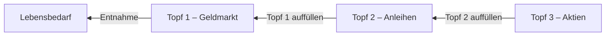

# Gesamtspec für Codex – Optimierung Ruhestands-Check

Bitte die bestehende App gezielt überarbeiten. Aktuelle Gestaltung, Navigation, Berechnungslogik und funktionierende Elemente grundsätzlich beibehalten. Keine vollständige Neugestaltung und keine zusätzlichen Hauptscreens erstellen.

## 0. Regeln dauerhaft im Projekt speichern

Diese Spezifikation enthält verbindliche Produkt-, Darstellungs- und Berechnungsregeln. Sie muss dauerhaft im Repository dokumentiert werden.

1. Bestehende Projektdokumentation prüfen und nicht überschreiben.
2. Technische Arbeitsanweisungen in `AGENTS.md` ergänzen.
3. Fachliche Berechnungs-, Steuer-, UX-, Text- und Darstellungsregeln strukturiert in `docs/PRODUCT_RULES.md` speichern.
4. In `AGENTS.md` verbindlich auf diese Regeln verweisen. Vor zukünftigen App-Änderungen beide Dateien lesen und berücksichtigen.
5. Widersprüche vor der Umsetzung ausdrücklich nennen. Nach fachlichen Änderungen prüfen, ob die Regeln aktualisiert werden müssen.
6. Dokumentation und Code gemeinsam committen. Abschliessend die Dokumentationsdateien, neu aufgenommenen Regeln und zukünftige Lesepflicht bestätigen.

## 1. Speichern und Laden reparieren – höchste Priorität

Der Stand lässt sich aktuell nicht mehr zuverlässig speichern. Diese Funktion zuerst reparieren.

Der Button soll heißen:

> Auf diesem Gerät speichern

Zu speichern sind sämtliche für die Wiederherstellung der Planung notwendigen Werte:

* Status vor oder nach Pensionierung
* aktuelles Alter
* Pensionierungsalter
* Zielalter
* Wohnkanton
* PK-Guthaben
* Säule 3a
* Wertschriften
* Bankguthaben und weiteres Vermögen
* Immobilienwerte und Hypotheken
* PK-Beiträge von Arbeitnehmer und Arbeitgeber
* Rendite- und Verzinsungsannahmen
* PK-Aufteilung zwischen Kapital und Rente
* AHV, weitere Renten und weitere Einnahmen
* Lebensbedarf und alle Lebensphasen
* zeitlich begrenzte Einnahmen
* Aufteilung des Immobilienvermögens
* Einstellungen und Annahmen des Drei-Töpfe-Modells
* Steuer- und Inflationsannahmen

Nach erfolgreichem Speichern anzeigen:

> ✓ Dein Stand wurde auf diesem Gerät gespeichert.

Zusätzlich anzeigen:

> Zuletzt gespeichert: [Datum] um [Uhrzeit]

Auf dem Startscreen muss danach der Button erscheinen:

> Meinen Stand laden

Nach dem Laden müssen alle Eingaben, Berechnungen, Resultate und gewählten Optionen identisch wiederhergestellt werden.

Fehler beim Speichern oder Laden dürfen nicht stillschweigend bleiben. Eine verständliche Fehlermeldung anzeigen.

### Kompatibilität

Gespeicherte Daten müssen möglichst auch nach einem neuen Deployment geladen werden können. Dafür eine Versionsnummer im gespeicherten Datenobjekt vorsehen und ältere Daten bei Bedarf migrieren.

### Abnahmetest

1. Vollständige Planung erfassen.
2. Stand speichern.
3. Browserseite neu laden.
4. „Meinen Stand laden“ auswählen.
5. Eingaben und Resultate mit dem vorherigen Stand vergleichen.
6. Test nach einem neuen Deployment wiederholen.
7. Speichern und Laden auf Desktop und Mobile testen.

---

## 2. Vorausgefüllte Beispielwerte kennzeichnen

Beim ersten Start sind bereits Beispielwerte vorhanden. Nutzer dürfen diese nicht mit eigenen oder gespeicherten Daten verwechseln.

Über den vorausgefüllten Eingaben anzeigen:

> Beispielwerte – bitte durch deine persönlichen Angaben ersetzen.

Der Hinweis verschwindet, sobald:

* der Nutzer einen Beispielwert verändert oder
* ein gespeicherter persönlicher Stand geladen wurde.

Die Beispielwerte nicht generell auf null setzen. Die App soll beim ersten Test weiterhin eine vollständige Berechnung ermöglichen.

Gespeicherte persönliche Werte dürfen niemals als Beispielwerte gekennzeichnet werden.

---

## 3. Einkommensübersicht korrigieren

In der Ergebnisübersicht werden aktuell „Gesamt“ und „Netto verfügbare Einnahmen“ mit demselben Betrag dargestellt. Diese Dopplung entfernen.

Der obere Ergebnisbereich soll folgende Struktur erhalten:

### Kapital

* Gesamt
* Gebunden
* Verfügbar

### Einkommen

* Netto gesamt
* aus AHV und Renten
* aus weiteren Einnahmen
* benötigte Kapitalentnahme

Beispiel:

| Einkommen                 |        Betrag |
| ------------------------- | ------------: |
| Netto gesamt              | CHF 47’815/J. |
| aus AHV und Renten        | CHF 47’815/J. |
| aus weiteren Einnahmen    |      CHF 0/J. |
| benötigte Kapitalentnahme | CHF 42’185/J. |

Kapitalerträge nicht als sichere laufende Einnahmen darstellen. Sie sind Bestandteil der Kapitalentwicklung.

Die benötigte Kapitalentnahme berechnet sich aus:

```text
Lebensbedarf – netto verfügbare laufende Einnahmen
```

Falls die laufenden Einnahmen den Bedarf vollständig decken, anzeigen:

> Keine Kapitalentnahme erforderlich

---

## 4. Steuerinformation verständlicher formulieren

Die bisherige Formulierung:

> Laufendes steuerbares Einkommen: ca. 13,5 % · Aktuelle Stufe: tief.

vollständig entfernen.

Insbesondere „Aktuelle Stufe: tief“ ersatzlos streichen.

### Neuer dynamischer Text

> **Laufende Einkommenssteuer**
>
> Bei einem jährlichen Einkommen von **CHF [Bruttoeinkommen]** rechnen wir für **[Wohnkanton]** vereinfacht mit einer Einkommenssteuer von rund **CHF [Einkommenssteuer] pro Jahr**. Das entspricht einem angenommenen Steuersatz von **[Steuersatz] %**.
>
> Die tatsächliche Steuer hängt unter anderem von der Wohngemeinde, dem Zivilstand, der Konfession, den Abzügen und weiteren Einkünften ab.

Beispiel:

> Bei einem jährlichen Einkommen von **CHF 55’278** rechnen wir für **Appenzell Ausserrhoden** vereinfacht mit einer Einkommenssteuer von rund **CHF 7’463 pro Jahr**. Das entspricht einem angenommenen Steuersatz von **13,5 %**.

Folgende Werte dynamisch einsetzen:

* `[Bruttoeinkommen]`: gesamtes laufendes Bruttoeinkommen pro Jahr
* `[Einkommenssteuer]`: berechnete jährliche Einkommenssteuer
* `[Steuersatz]`: verwendeter Steuersatz
* `[Wohnkanton]`: ausgeschriebener Name des gewählten Kantons

Die Werte müssen sich sofort aktualisieren, wenn sich Wohnkanton, Einnahmen oder PK-Aufteilung ändern.

### Kapitalbezugssteuer separat erklären

Direkt anschließend anzeigen:

> **Kapitalbezugssteuer**
>
> Der Kapitalbezug aus der Pensionskasse wird separat mit einem reduzierten Steuersatz berechnet. Bereits bestehendes freies Vermögen wird nicht mit einer Kapitalbezugssteuer belastet.

Bei einem PK-Kapitalbezug weiterhin separat anzeigen:

* PK-Kapital brutto
* geschätzte Kapitalbezugssteuer
* PK-Kapital netto
* bestehendes freies Vermögen ohne PK
* gesamtes Anlagekapital

Nur der bezogene PK-Kapitalanteil darf der Kapitalbezugssteuer unterliegen.

---

## 5. Steuerhinweis kürzen und besser strukturieren

Den langen Steuertext im Informationsfeld kompakter gliedern:

### Steuerannahme

1. Laufende Einkommenssteuer mit konkretem Einkommen, Steuerbetrag und Steuersatz
2. Kapitalbezugssteuer
3. kurzer Hinweis auf die Modellgrenzen

Abschließender Hinweis:

> **Modellrechnung, keine individuelle Steuerberechnung.** Nicht berücksichtigt sind unter anderem die Vermögenssteuer und allfällige Steuern beim Bezug der Säule 3a. Zinsen und Dividenden werden in der vereinfachten Simulation nicht separat besteuert.

Die ESTV-Grundlage darf erwähnt werden, aber der Text soll auf Mobile nicht zu einer langen Textwand werden.

---

## 6. Risikoprofile fachlich präzisieren

Die aktuelle Bezeichnung „Ausgewogen“ kann missverstanden werden, weil trotz dieses Profils eine sehr hohe Aktienquote entstehen kann.

Profile umbenennen:

* „Renditeannahme vorsichtig · 2,5 %“
* „Renditeannahme ausgewogen · 4,5 %“
* „Renditeannahme chancenorientiert · 6,0 %“

Unterhalb der Auswahl anzeigen:

> Die Auswahl bestimmt die erwartete Rendite. Die Aufteilung auf die drei Töpfe ergibt sich separat aus deinem Finanzierungsbedarf und den Reservejahren.

Das Risikoprofil in dieser Runde nicht automatisch mit einer festen Aktienquote verknüpfen, sofern dafür noch kein abgestimmtes Berechnungsmodell existiert.

---

## 7. Drei-Töpfe-Modell fachlich korrekt darstellen

Die Töpfe nicht einfach nur in numerischer Reihenfolge darstellen. Entscheidend ist der tatsächliche Geldfluss:



Die Darstellung muss klar zeigen:

* Topf 1 finanziert die laufenden Entnahmen.
* Topf 1 wird aus Topf 2 aufgefüllt.
* Topf 2 wird grundsätzlich aus Topf 3 aufgefüllt.
* Topf 3 enthält das langfristig investierte Kapital.
* Die Töpfe werden im Rahmen des jährlichen Rebalancings geprüft und angepasst.
* Topf 2 dient als Reserve, damit nach einem Kursverlust nicht zwingend sofort Aktien verkauft werden müssen.
* Gebundenes Immobilienkapital bleibt als separater Nebentopf sichtbar.

Die bestehende Anordnung **Topf 2 → Topf 1 → Auszahlung** kann beibehalten werden. Zusätzlich muss sichtbar werden, dass **Topf 2 aus Topf 3 aufgefüllt wird**.

Titel:

> So fliesst dein Geld durch die drei Töpfe

Den Text:

> Jährlich die Reserven auffüllen

ersetzen durch:

> Jährlich prüfen und die Töpfe bedarfsgerecht ausgleichen

Bei der Aktienquote ergänzen:

> Die Aktienquote ergibt sich aus dem verbleibenden Anlagekapital, nachdem die geplanten Entnahmen in Topf 1 und Topf 2 reserviert wurden.

Nicht behaupten, dass die Aktienquote direkt aus dem gewählten Renditeprofil stammt.

---

## 8. Ergebnisformulierung weniger definitiv machen

Die Aussage:

> Dein Plan geht grundsätzlich auf

ersetzen durch:

> Unter den gewählten Annahmen ist dein gewünschter Lebensstandard bis Alter [Zielalter] finanzierbar.

Direkt darunter prominent anzeigen:

> Erwartetes Restkapital mit Alter [Zielalter]: ca. CHF [Restkapital]

Falls das Kapital vor dem Zielalter aufgebraucht wird:

> Unter den gewählten Annahmen reicht dein verfügbares Kapital voraussichtlich bis Alter [Alter].

In diesem Fall keine grüne Erfolgsmeldung anzeigen.

Die Formulierung:

> Standortbestimmung abgeschlossen

ersetzen durch:

> Deine erste Planung steht.

Die Aussage muss sich auf die aktuell gewählte PK-Aufteilung beziehen und nicht lediglich darauf, dass irgendeine mögliche PK-Aufteilung finanzierbar wäre.

---

## 9. Entwicklungsdiagramm fachlich^W Entwicklungsdiagram fachlich präzisieren

Den Titel:

> Pessistische und, pessimistische und optimistische Variante

ersetzen durch:

> Ungünstige und günstige Renditereihenfolge

Bezeichnungen ändern:

* Pessimistisch → Ungünstige Reihenfolge
* Optimistisch → Günstige Reihenfolge

Erklärung:

> Beide Varianten verwenden dieselben historischen Jahresrenditen von 2016 bis 2025. Nur deren Reihenfolge ist unterschiedlich.

Unterhalb des Diagramms ergänzen:

> Die Grafik zeigt bewusst die ersten zehn Ruhestandsjahre, weil das Reihenfolgerisiko in dieser Phase besonders relevant ist. Die gesamte Planung läuft bis zu deinem gewählten Zielalter weiter.

Weitere Vorgaben:

* Die jetzt gut lesbaren Werte an den Datenpunkten beibehalten.
* Die fehlerhafte Achsenbeschriftung „0’000“ durch „0“ ersetzen.
* Keine Werte überlappen lassen.
* Auf Mobile kein horizontales Scrollen.
* Falls nicht genügend Platz vorhanden ist, weniger Werte direkt im Diagramm und die vollständigen Werte in den bestehenden Karten darunter anzeigen.

---

## 10. Inflationslogik klar kommunizieren

Auf dem Annahmen-Screen anzeigen:

> Alle Vermögenswerte werden zunächst bis zum Pensionierungszeitpunkt hochgerechnet. Die Inflation wird erst während der Ruhestandsphase berücksichtigt. Der dargestellte Lebensstandard bleibt dadurch in heutiger Kaufkraft vergleichbar.

Berechnungsregeln:

* Keine Inflation auf den Lebensbedarf vor der Pensionierung anwenden.
* Die eigentliche Ruhestandssimulation startet am Pensionierungszeitpunkt.
* PK, Säule 3a und Wertschriften werden bis zur Pensionierung weiterhin mit den jeweiligen Beiträgen und Renditeannahmen hochgerechnet.
* Ab dem Pensionierungszeitpunkt wird der Lebensbedarf in der Simulation anhand der Inflationsannahme weiterentwickelt.
* Bestehendes freies Kapital wird nicht mit einer Kapitalbezugssteuer belastet.
* Nur der bezogene PK-Kapitalanteil wird um die geschätzte Kapitalbezugssteuer reduziert.
* Das gesamte frei verfügbare Kapital fließt am Pensionierungszeitpunkt in das Anlagekapital.

Die Begriffe „heutige Kaufkraft“, „Wert bei Pensionierung“ und „nominaler Betrag“ müssen konsistent verwendet werden.

---

## 11. Text- und Qualitätskorrekturen

* Sämtliche Beschriftungen „Aendern“ durch „Ändern“ ersetzen.
* „Meinen Stand speichern“ durch „Auf diesem Gerät speichern“ ersetzen.
* Erklärung zur lokalen Speicherung beibehalten.
* Alle Eingabefelder mit eindeutigen sichtbaren Labels und `aria-label` versehen.
* Beispiele:

  * Aktuelles PK-Guthaben
  * Aktueller Stand Säule 3a
  * Wertschriften heute
  * Marktwert Immobilien
  * Hypotheken
  * Bank und übriges Vermögen
  * PK-Beitrag Arbeitnehmer
  * PK-Beitrag Arbeitgeber
* Buttons und Eingabefelder müssen per Tastatur bedienbar sein.
* Beträge mit Schweizer Tausendertrennzeichen darstellen.
* Prozentwerte einheitlich mit Komma anzeigen, beispielsweise `13,5 %`.
* Auf Mobile dürfen keine abgeschnittenen Texte oder horizontalen Scrollbereiche entstehen.

---

## 12. Regressionstests

Nach der Umsetzung beide vollständigen Wege testen:

### Vor Pensionierung

* Alter und Pensionierungsalter
* Vermögen heute
* Aufbauphase
* Einnahmen
* Lebensbedarf
* Zielalter
* PK-Aufteilung
* Steuern
* Ergebnisübersicht
* Drei Töpfe
* Entwicklung
* Annahmen
* Angaben
* Speichern und Laden

### Bereits pensioniert

* aktuelles Vermögen
* bestehende Renten und Einnahmen
* Lebensbedarf
* Zielalter
* Steuern
* Drei-Töpfe-Modell
* Entwicklung
* Speichern und Laden

Dabei prüfen:

* Alle Gesamtsummen stimmen.
* Gebundenes und verfügbares Kapital werden korrekt getrennt.
* Gesamtes Anlagekapital enthält das vorhandene freie Vermögen und das PK-Kapital nach Kapitalbezugssteuer.
* Bestehendes freies Vermögen wird nicht nochmals besteuert.
* Einkommenssteuer stimmt auf allen Screens überein.
* Änderungen am Wohnkanton aktualisieren die Steuerannahmen.
* Änderungen an der PK-Aufteilung aktualisieren Einkommen, Steuern und Anlagekapital.
* Die Ergebnisse bleiben nach Speichern, Neuladen und Laden des Standes identisch.
* Keine Darstellungsfehler auf Mobile und Desktop.
